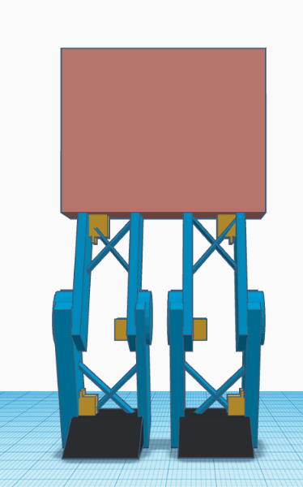

# task one  
* **OverView**
    * this is 3D modeling about how to draw robot's legs with 6 servo motors built-in

* **Requirements**
    * any 3D design etc tinkercad or cinema 4D
    * 6 Servo motors
    * 4 cross-props
    * 2 feet
    * 2 legs
    * 2 thighs
    * 2 revolution circles
    * 1 middle body
* **Source link**  
    * [click here](https://www.tinkercad.com/things/9wfB3m866Ao-legs-with-6-servo-motors?sharecode=6Noxx_fnurXRgr8VZqs7S4oOl4roi44QUJ65jeSR17A)

* **Design**  
    
